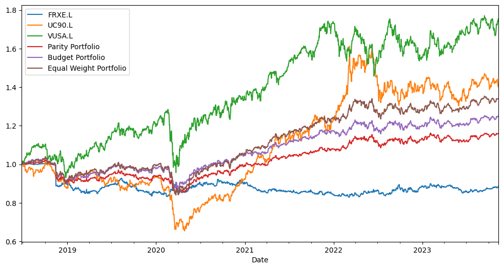
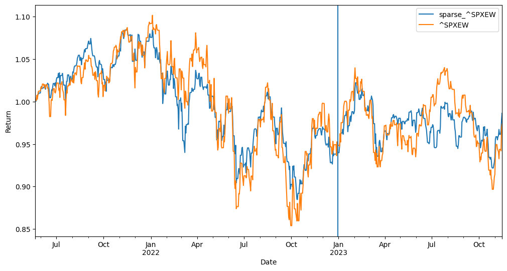

# Quant Portfolios

- Uses [Prof. Daniel P. Palomar](https://github.com/dppalomar) and the [Convex Research](https://github.com/convexfi) group's quantitative tools to model stocks, construct and backtest risk parity/budgeting portfolios.

## Tasks/Tools:

- Selects list of tickers to model and construct a portfolio using factor based models (TBD)
- Fits Multivariate Student's t distribution to a list of stocks using [fitHeavyTail](https://github.com/convexfi/fitHeavyTail)
- Constructs a risk parity/budgeting portfolio using [riskParity.py](https://github.com/convexfi/riskparity.py)
- Constructs sparse portfolio using [sparseIndexTracking](https://github.com/dppalomar/sparseIndexTracking)
- Backtests returns of constructed portfolios

## Requirements:

- Python
- [rpy2](https://github.com/rpy2/rpy2)
- R compiler
- requirements.txt

# Risk Parity Portfolio:

| Portfolio                   | FRXE.L (%) | UC90.L (%) | VUSA.L (%) |
| --------------------------- | ---------- | ---------- | ---------- |
| Risk Parity                 | 56.6       | 24.5       | 18.9       |
| Risk Budget (60%, 20%, 20%) | 47.4       | 20.0       | 32.6       |
| Equal Weight                | 33         | 33         | 33         |

# Sparse Portfolio:

| Ticker | Weight (%) |
| ------ | ---------- |
| VMID.L | 30.6       |
| VUKE.L | 24.1       |
| V3AM.L | 45.3       |
